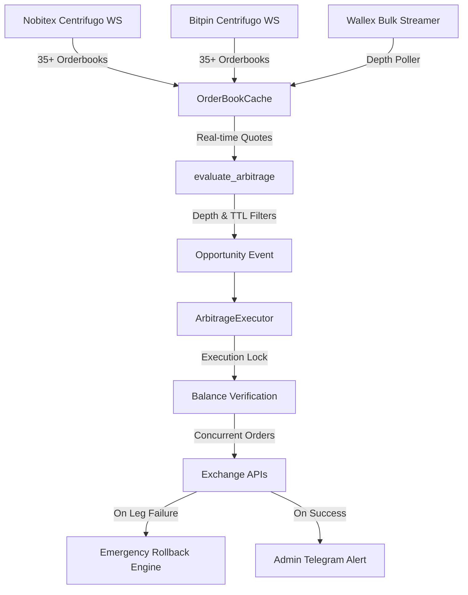

# Real-Time WebSocket Crypto Arbitrage & Auto-Execution Bot (v2.0 Hardened)

A high-speed, production-hardened cryptocurrency arbitrage trading engine designed for Iranian exchanges (**Nobitex**, **Bitpin**, and **Wallex**). It streams real-time orderbooks via multiplexed WebSockets, analyzes cross-exchange price spreads with microsecond latency, and automatically executes atomic hedged trades using private API keys.

---

## 🛡️ Recent Upgrades & Production Hardening (Audit v2.0)

Following a deep production-readiness audit, the entire engine underwent extensive mathematical, concurrency, and execution hardening to eliminate capital risks:

1. **Wallex Response Bug Fix**:
   - *Problem*: Wallex returns HTTP 200 even when orders are rejected (`{"success": false}`). The previous logic treated any 200 status as successful, leaving the opposing leg unhedged.
   - *Fix*: Enforced strict verification `if data.get("success") is True and "result" in data:` in [`exchanges.py`](exchanges.py).

2. **Atomic Emergency Rollback Engine**:
   - *Problem*: If Leg 1 (Buy) executes but Leg 2 (Sell) fails or is rejected, the position is left completely unhedged (Leg Risk).
   - *Fix*: Implemented `enable_auto_rollback` in [`execution.py`](execution.py). If one leg fails, the engine immediately dispatches an automated market rollback order (dumps the bought coin back to USDT or re-buys the sold inventory) to close directional exposure.

3. **Concurrency & Capital Race Condition Lock**:
   - *Problem*: When multiple symbols triggered arbitrage simultaneously, asynchronous balance checks allowed multiple orders to over-allocate the same USDT balance, leading to mid-trade rejections.
   - *Fix*: Integrated a centralized `asyncio.Lock()` around pre-flight balance validation and order execution, guaranteeing linear and conflict-free capital allocation.

4. **Slippage Protection & Limit Orders**:
   - *Problem*: Unconditional market orders swept thin orderbooks, wiping out margins.
   - *Fix*: Converted orders from market to protected limit orders bounded by `max_buy_price = opp.buy_price * (1 + max_slippage_pct)` and `min_sell_price = opp.sell_price * (1 - max_slippage_pct)`.

5. **Quote Staleness & Phantom Spread Elimination (TTL)**:
   - *Problem*: Stale quotes from paused streams caused the bot to execute against expired prices.
   - *Fix*: Integrated quote timestamps and a strict TTL filter (`max_quote_age_seconds = 2.0s`) in [`models.py`](models.py). Outdated quotes are immediately rejected.

6. **Orderbook Depth Validation**:
   - *Problem*: High spreads with low liquidity caused immediate blowout.
   - *Fix*: Enabled strict top-of-book volume verification (`require_sufficient_depth`). Quotes must have volume covering at least 95% of the intended trade capital.

7. **Spot Fee Deduction & Zero-Depletion Model**:
   - *Problem*: Crypto spot exchanges deduct taker fees from the acquired base coin upon buying. Dispatching identical buy and sell amounts depleted coin inventories over time.
   - *Fix*: Sized buy orders using `gross_coin_amount` and sell orders using net received coins (`coin_bought`), maintaining a perfectly balanced inventory.

8. **High-Precision Decimal Quantization**:
   - *Problem*: Python floating-point errors (e.g., `0.12340000000000001`) caused exchanges to reject orders due to stepSize violations.
   - *Fix*: Replaced floating-point math with `decimal.Decimal` and `ROUND_DOWN` quantization in [`exchanges.py`](exchanges.py).

9. **Half-Open TCP Socket Watchdog**:
   - *Problem*: `ping_interval=None` caused silent WebSocket disconnects to freeze data ingestion.
   - *Fix*: Added `ping_interval=20, ping_timeout=10` along with Centrifugo keepalive ping/pong handling.

10. **Telegram Security & Privacy Isolation**:
    - *Problem*: Public `/start` subscribers received sensitive execution receipts, and `/balance` was unrestricted.
    - *Fix*: Restricted `/balance` and financial execution receipts exclusively to verified `TELEGRAM_ADMIN_IDS` using asynchronous non-blocking storage (`aiofiles`).

---

## ⚡ Architecture & Supported Exchanges



| Exchange | WebSocket Protocol | REST Execution API | Default Fee |
| :--- | :--- | :--- | :---: |
| **Nobitex** | Centrifugo (`wss://ws.nobitex.ir`) | `/market/orders/add` | 0.15% |
| **Bitpin**  | Centrifugo (`wss://centrifugo.bitpin.org`) | `/v1/odr/orders/` | 0.15% |
| **Wallex**  | High-Frequency Poller (`/v1/depth`) | `/v1/account/orders` | 0.20% |

---

## 💼 Dual-Inventory Model (Minimal 24 USDT Setup)

Cross-exchange spot arbitrage requires pre-funded balances on both exchanges to execute simultaneously without on-chain transfer delays:

### Recommended Minimal Allocation:
- **Total Capital**: ~24 USDT
- **Nobitex**:
  - `7.00 USDT` cash
  - `5.00 USDT` worth of **SUI** (or active coin)
- **Bitpin**:
  - `7.00 USDT` cash
  - `5.00 USDT` worth of **SUI** (or active coin)
- **Trade Size per Arbitrage**: `5.00 USDT`

*Cycle Example*:
1. If price on Bitpin > Nobitex: Buy SUI with 5 USDT on Nobitex, simultaneously sell 5 USDT of SUI on Bitpin.
2. If price on Nobitex > Bitpin: Buy SUI with 5 USDT on Bitpin, simultaneously sell 5 USDT of SUI on Nobitex.
3. Inventory self-rebalances naturally across two-way market fluctuations.

---

## 🚀 Quick Start

### 1. Requirements & Dependencies
Ensure Python 3.10+ is installed, then install dependencies:
```bash
pip install -r requirements.txt
```
*(Dependencies: `websockets`, `httpx`, `python-dotenv`, `aiofiles`)*

### 2. Environment Configuration
Create or edit your `.env` file:
```env
# Telegram Bot Settings
TELEGRAM_BOT_TOKEN=8204952642:AAH_RSBCbN9kb9sil2EJ0RdMmLvN8HywSQ4
TELEGRAM_ADMIN_IDS=1035365638

# Exchange API Credentials
NOBITEX_API_TOKEN=your_nobitex_api_token
BITPIN_API_KEY=your_bitpin_api_key
WALLEX_API_KEY=your_wallex_api_key

# Trading & Risk Controls
DRY_RUN=true
TRADE_AMOUNT_USDT=5.0
MIN_PROFIT_USDT=0.01
MIN_ROI_PCT=0.35
MAX_SLIPPAGE_PCT=0.30
MAX_QUOTE_AGE_SECONDS=2.0
REQUIRE_SUFFICIENT_DEPTH=true
ENABLE_AUTO_ROLLBACK=true
TRADE_COOLDOWN_SECONDS=30
```

### 3. Run Automated Unit Tests
Run the test suite to verify mathematical precision, staleness rejection, depth protection, and simulated execution:
```bash
python test_bot.py
```
Expected output:
```text
✅ evaluate_arbitrage math verified: Net Profit = 0.6972 USDT, ROI = 0.70%
✅ Precision rounding verified!
  • Stale quote correctly rejected! ✅
  • Thin orderbook correctly rejected to prevent slippage! ✅
✅ Cache opportunity callback verified! Found 1 opportunity(ies).
✅ Simulated execution verified!
✅ Asynchronous aiofiles SubscriberManager verified!
🎉 ALL UNIT TESTS PASSED SUCCESSFULLY!
```

### 4. Launch the Bot
```bash
python main.py
```

---

## 📱 Telegram Bot Commands

Control and monitor the bot in real time via your configured Telegram bot (`@arbittseppbot`):

| Command | Permission | Description |
| :--- | :---: | :--- |
| `/status` | Public | View engine status, monitored coins, session profit, and trade count. |
| `/help` | Public | Display interactive command list and usage guidance. |
| `/start` | Public | Subscribe to alerts. |
| `/stop` | Public | Unsubscribe from alerts. |
| `/balance` | **Admin Only** | Fetch live wallet balances across Nobitex, Bitpin, and Wallex. |
| `/dryrun [on\|off]` | **Admin Only** | Toggle between Paper Trading (`on`) and Live Money Execution (`off`). |
| `/capital <usdt>` | **Admin Only** | Change trade capital per arbitrage (e.g. `/capital 5.0`). |
| `/minprofit <pct>` | **Admin Only** | Change minimum ROI threshold (e.g. `/minprofit 0.40`). |
| `/kill` | **Admin Only** | **Emergency Stop**: Instantly halt all automated order execution. |
| `/resume` | **Admin Only** | Resume automated trading after inspection. |

---

## ⚠️ Pre-Live Trading Checklist

Before setting `DRY_RUN=false`:

1. [ ] **Wallex IP Restriction**: In Wallex Dashboard -> API Management, disable "IP Whitelist" (unless running on a static VPS).
2. [ ] **Nobitex Token**: Ensure your Nobitex API Token is valid and has "Trading" permissions enabled (avoid withdrawal permissions).
3. [ ] **Bitpin Credentials**: Ensure your Bitpin API Key is authorized for trading endpoints.
4. [ ] **Wallet Balances**: Verify using `/balance` that required USDT and coin inventories are funded.
5. [ ] **Initial Test**: Keep `DRY_RUN=true` for at least 1-2 hours to observe live spread captures and latency behavior.
